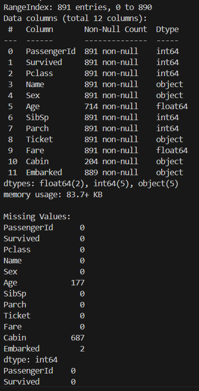
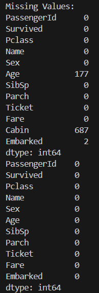
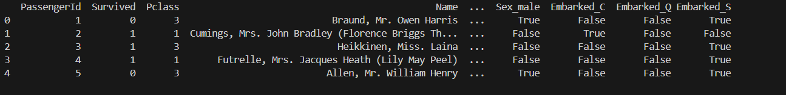
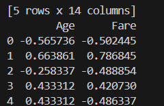
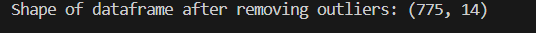
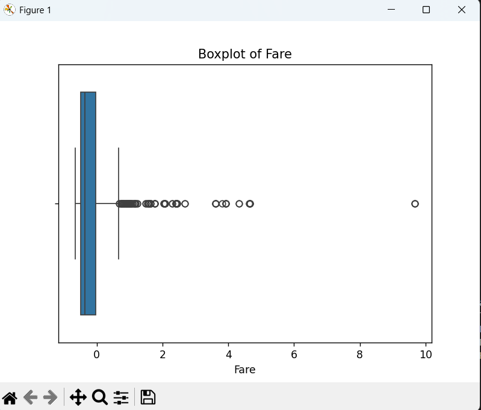

1.Import the dataset and explore basic info (nulls, data types)

Learned  how to import and explore dataset.

2.Handle missing values using mean/median/imputation.

learned how to handle missing values using mean and mode.

3.Convert categorical features into numerical using encoding.

4.Normalize/standardize the numerical features.

5.Visualize outliers using boxplots and remove them
-removed outliner
-visualization.

